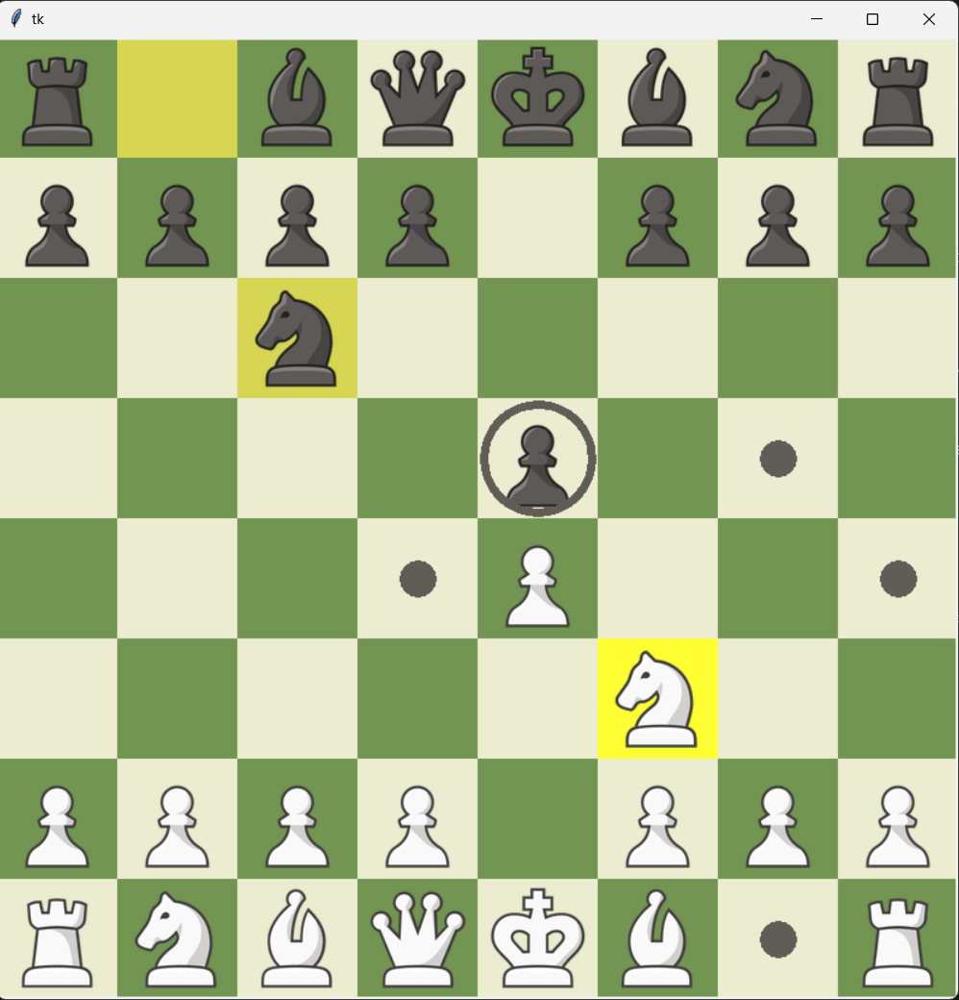

# Chess-Game 

Chess Game is a 2 player Chess python application. This project implements a graphical chess interface using Tkinter, allowing users to play chess interactively on a visually rendered board.



## Features

### Graphical Board Display

- The chessboard is displayed using a Tkinter `Canvas`.
- Light and dark squares alternate, providing a classic chessboard look.

### Piece Rendering

- Chess pieces are rendered using images loaded from the `images` directory.
- Images are dynamically scaled to fit the square size for a responsive UI.

### Interactive Gameplay

- Players can select and move pieces by clicking on the board.
- Highlights valid moves for the selected piece.
- Enforces turn-based play (white and black alternate turns).

### Move Handling

- Validates moves using the `MoveGenerator` class.
- Animates piece movements, including special moves like castling.

### Turn Management

- Tracks the current player's turn.
- Automatically switches turns after a valid move.

### Game State Checking

- Detects game-ending conditions such as checkmate or stalemate.
- Displays the game result using message boxes.

### Animations

- Smooth animations for piece movements and castling enhance the user experience.

### Scalable UI

- The board dynamically adjusts to an 800x800 layout.

### Modular Design

- Integrates with `Board` and `MoveGenerator` modules to validate and execute game logic.

## Directory Structure

```
chess-engine/
├── images/                # Folder containing chess piece images.
├── board.py              # Module for board representation and logic.
├── move_generator.py     # Module for generating and filtering moves.
├── chess_ui.py           # Main GUI script.
├── README.md             # Project documentation.

```

## Usage

1. Ensure that you have Python 3.x installed.
2. Install required dependencies:
   ```bash
   pip install pillow
   ```
3. Place the chess piece images in the `images/` directory. The filenames should match the following convention:
   - `white-king.png`, `white-queen.png`, `white-rook.png`, `white-bishop.png`, `white-knight.png`, `white-pawn.png`
   - `black-king.png`, `black-queen.png`, `black-rook.png`, `black-bishop.png`, `black-knight.png`, `black-pawn.png`
4. Run the GUI:
   ```bash
   python chess_ui.py
   ```

## Future Enhancements

1. **AI Integration**:

   - Implement an AI opponent using algorithms like Minimax with Alpha-Beta pruning.

2. **Analyze Mode**:

   - Add features like move suggestions, blunder detection, and alternative lines using the move generator.

3. **Customizability**:
   - Allow customization of board and piece colors and square sizes.

## Dependencies

- **Python 3.x**
- **Tkinter**: Comes pre-installed with Python.
- **Pillow**: For handling chess piece images.

## Contributing

Contributions are welcome! Please create a pull request with a detailed description of your changes.
